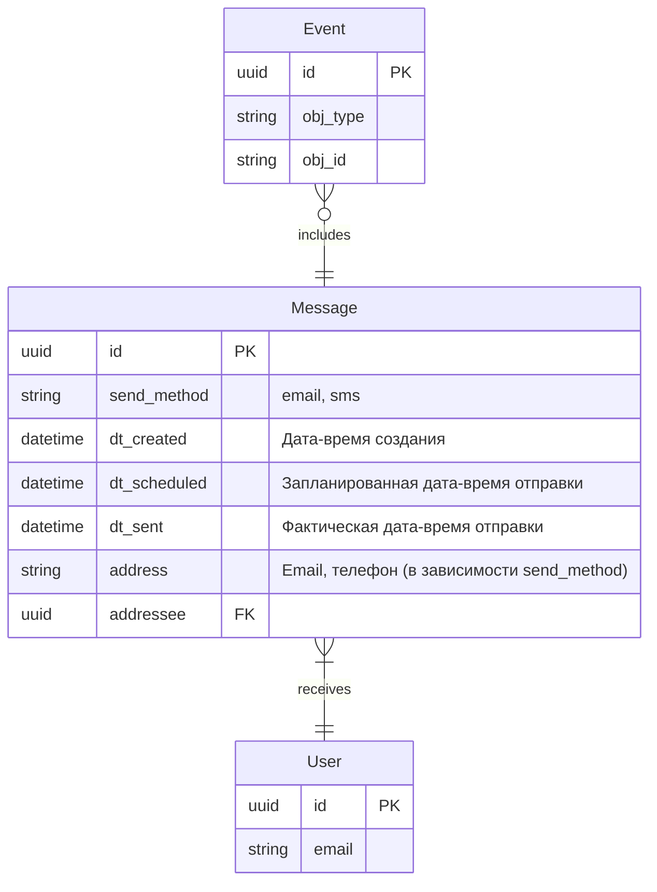

# ERD

```mermaid
erDiagram
    message[Message] {
        uuid id PK
        string send_method "email, sms"
        datetime dt_created "Дата-время создания"
        datetime dt_scheduled "Запланированная дата-время отправки"
        datetime dt_sent "Фактическая дата-время отправки"
        string address "Email, телефон (в зависимости send_method)"
        uuid addressee FK
    }

    event["Event"] {
        uuid id PK
        string obj_type
        string obj_id
    }

    user[User] {
        uuid id PK
        string email
    }

    event }o--|| message : includes
    message }|--|| user : receives

```