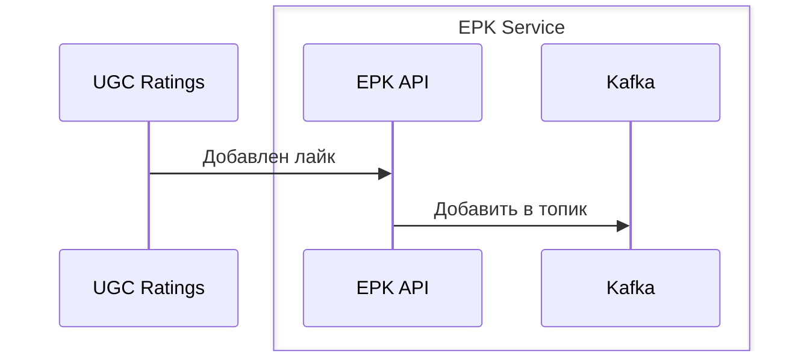
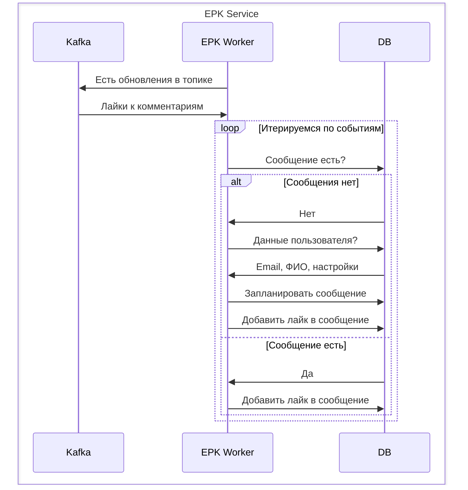
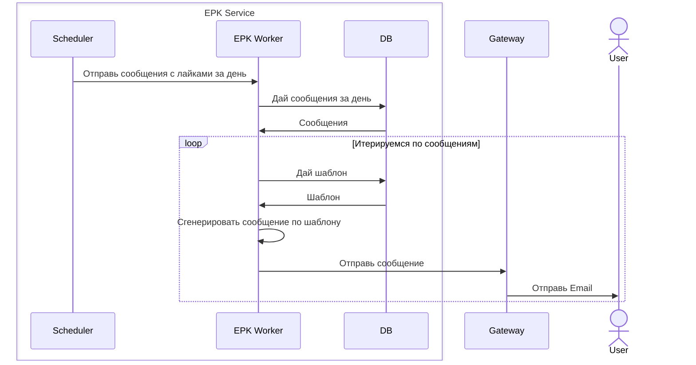

## Добавление новых сообщений 

```mermaid
sequenceDiagram
    participant UGC as UGC Ratings
    box EPK Service
        participant API as EPK API
        participant Kafka
    end
    UGC->>API: Добавлен лайк
    API->>Kafka: Добавить в топик
```
## Обработка сообщений

```mermaid
sequenceDiagram
    box EPK Service
        participant Kafka
        participant Worker as EPK Worker
        participant DB
    end
    Worker->>Kafka: Есть обновления в топике
    Kafka->>Worker: Лайки к комментариям
    loop Итерируемся по событиям
        Worker->>DB: Сообщение есть?
        alt Сообщения нет
            DB->>Worker: Нет
            Worker->>DB: Данные пользователя?
            DB->>Worker: Email, ФИО, настройки
            Worker->>DB: Запланировать сообщение
            Worker->>DB: Добавить лайк в сообщение
        else Сообщение есть
            DB->>Worker: Да
            Worker->>DB: Добавить лайк в сообщение
        end
    end
```

```mermaid
sequenceDiagram
    box EPK Service
        participant S as Scheduler
        participant Worker as EPK Worker
        participant DB
    end
    participant Gateway
    actor User
    S->>Worker: Отправь сообщения с лайками за день
    Worker->>DB: Дай сообщения за день
    DB->>Worker: Сообщения
    loop Итерируемся по сообщениям
        Worker->>DB: Дай шаблон
        DB->>Worker: Шаблон
        Worker->>Worker: Сгенерировать сообщение по шаблону
        Worker->>Gateway: Отправь сообщение
        Gateway->>User: Отправь Email
    end
```
